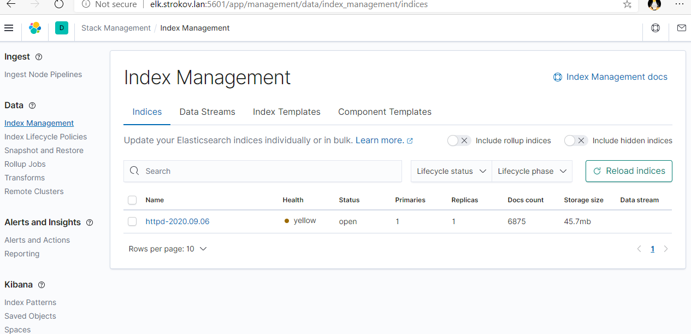
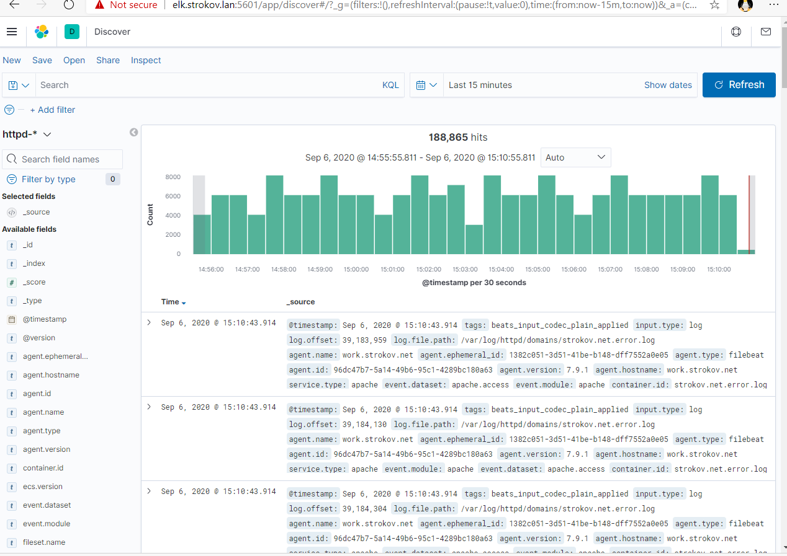

# Домашнее задание.  
## Установка ELK

Для установки используем свежую копию виртуальной машины под управлением Centos 7.4  
Все действия выполняем от суперпользователя root либо через sudo su.

Обновляем систему
```bash
yum update -y
```
Устанавливаем java
```bash
yum install -y java
```

Импортируем подпись репозитория logstash в систему
```bash
rpm --import https://artifacts.elastic.co/GPG-KEY-elasticsearch
```
Копируем прилагаемый файл [elastiksearch.repo](templates%2Felasticsearch.repo) в /etc/yum.repos.d

Копируем прилагаемый файл [kibana.repo](templates%2Fkibana.repo) в /etc/yum.repos.d

Устанавливаем необходимые пакеты
```bash
yum install -y elasticsearch kibana logstash
```
Перечитываем изменения в системных сервисах.
```bash
systemctl daemon-reload
```
Разрешаем автозагрузку для установленных сервисов
```bash
systemctl enable elasticsearch.service
systemctl enable kibana.service
systemctl enable logstash.service
```

Запускаем elasticsearch и kibana
```bash
systemctl start elasticsearch.service
systemctl start kibana.service
```

Разрешаем доступ к kibana (порт 5601) и logstash (порт 5044) по сети
```bash
firewall-cmd --zone=public --add-port=5601/tcp --permanent
firewall-cmd --zone=public --add-port=5044/tcp --permanent
firewall-cmd --reload
```

Настраиваем logstash.
Будем собирать логи apache.
Копируем прилагаемые файлы [beats.conf](templates%2Fbeats.conf) (указание на каком порту слушать поток данных) , [output.conf](templates%2Foutput.conf) (отдавать логи в elasticsearch запущенный  локально) в папку /etc/logstash/conf.d/.

Запускаем logstash
```bash
systemctl start logstash.service
```

Устанавливаем на машину с работающим web сервером filebeat.
```bash
rpm -vi https://artifacts.elastic.co/downloads/beats/filebeat/filebeat-7.9.1-i686.rpm
```
Включаем поддержку apache в filebeat
```bash
filebeat modules enable nginx apache
```
Комментируем секцию output.elasticsearch и раскомментируем output.logstash.
hosts: ["xxx.xxx.xxx.xxx:5044"]

Направляем логи apache в logstash.  
```bash
filebeat modules enable apache
```
Редактируем  /etc/filebeat/modules.d/apache.yml
Меняем в секции access: var.path: на путь который указывает логи apache.
В моём случае /var/log/httpd/domains/*.log
Инициализируем хранилища filebeat 
```bash
filebeat setup
```

Настраиваем автозапуск filebeat и стартуем его.
```bash
systemctl enabls filebeat
systemctl start filebeat
```
Идём на машину с ELK на порт 5601 и смотрим что происходит.  
В секции Data -> Index Management кликаем на Reload indicies и в списке должны увидеть новый индекс, который описали выше httpd-YYYY.MM.DD.

# Скриншот 


# Смотрим что получаем.




